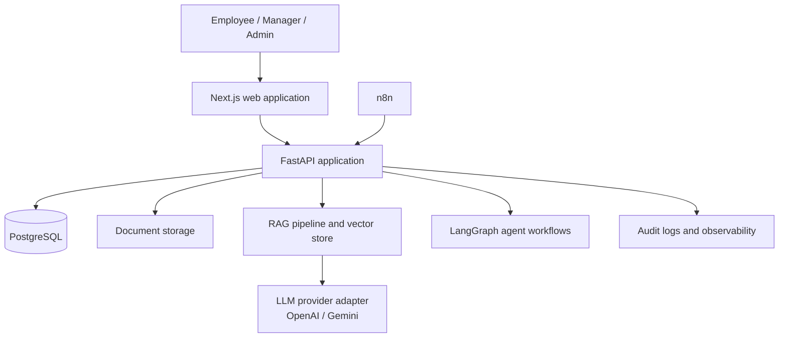

# Nexus — Enterprise AI Operating System

NexusAI is a full-stack enterprise AI platform for bringing company knowledge, AI-assisted work, business workflows, and operational insight into one secure workspace.

The project is designed as an AI/ML engineering portfolio application: it demonstrates modern frontend engineering, typed REST APIs, secure identity and access control, retrieval-augmented generation (RAG), AI agents, workflow automation, and deployment practices.

> **Current status:** Frontend workspace foundation and FastAPI service foundation are complete. Pages currently use clearly labeled demo data; database, authentication, document intelligence, RAG, agents, and workflow execution are planned next.

## Why NexusAI?

Organizations often keep policies, reports, documents, workflows, and AI tools in separate systems. NexusAI aims to provide one role-aware workspace where employees can:

- Find and understand company knowledge.
- Upload and manage enterprise documents.
- Ask grounded questions with cited sources.
- Work with specialized AI agents.
- Monitor tasks, analytics, reports, notifications, and automations.
- Keep AI-assisted operations auditable and permission-aware.

## Product modules

| Module | Purpose | Status |
| --- | --- | --- |
| Workspace UI | Landing page, navigation, dashboard, settings, admin area | Available with demo data |
| Enterprise AI Chat | Ask questions across company knowledge | UI preview |
| Knowledge & Documents | Organize and process internal sources | UI preview |
| Authentication & RBAC | Secure identity, roles, and protected routes | Planned |
| Document Intelligence | Upload, extract, chunk, embed, and index files | Planned |
| RAG | Grounded answers with citations and safeguards | Planned |
| AI Agents | Role-specific assistants and tool calling | Planned |
| Automation | Secure n8n webhook integration and workflow monitoring | Planned |
| Analytics & Reports | KPI views, insights, and executive reporting | UI preview |

## Architecture



### How the finished system will work

1. A user signs in to the Next.js application.
2. FastAPI validates the JWT and checks the user’s role and permissions.
3. When a document is uploaded, the backend validates it, stores it, extracts text, creates chunks and embeddings, and records metadata.
4. When a user asks a question, the RAG pipeline retrieves only the documents they are allowed to access.
5. An LLM receives the relevant context and returns an answer with citations, or explicitly states when evidence is insufficient.
6. AI agent and n8n workflow actions are logged for review, approval, and troubleshooting.

## Technology stack

### Frontend

- **Next.js 16** with the App Router
- **React 19** and **TypeScript**
- **Tailwind CSS 4**
- Reusable workspace layout and file-system routes

### Backend

- **Python** and **FastAPI**
- **Pydantic Settings** for environment-based configuration
- **SQLAlchemy** and **Alembic** for relational data and migrations
- **Pytest** and FastAPI’s test client for API verification

### Planned platform services

- PostgreSQL for persistent relational data
- Redis and background workers for queued work
- Local vector storage in development, with a path to Qdrant, Pinecone, or Weaviate
- OpenAI and Google Gemini behind an LLM provider abstraction
- LangGraph for multi-step agent workflows
- n8n for external triggers and long-running business automations
- Docker for repeatable development and production deployment

## Repository structure

```text
NEXUS-AI/
├── backend/
│   ├── app/
│   │   ├── api/          # API routers (grows with the product)
│   │   ├── core/         # Configuration, security, logging
│   │   ├── db/           # Database engine, sessions, migrations
│   │   ├── models/       # SQLAlchemy models
│   │   ├── schemas/      # Pydantic API contracts
│   │   └── services/     # Business logic
│   ├── tests/            # Backend tests
│   ├── .env.example      # Safe configuration template
│   └── requirements.txt
├── frontend/
│   └── src/
│       ├── app/          # Next.js pages and route layouts
│       └── components/   # Shared interface components
├── docs/                 # Architecture, API, security docs (planned)
└── README.md
```

## Current routes

| Route | Screen |
| --- | --- |
| `/` | Product landing page |
| `/login`, `/register` | Authentication UI previews |
| `/dashboard` | Workspace overview |
| `/chat` | Enterprise chat preview |
| `/knowledge`, `/documents`, `/documents/[id]` | Knowledge and document screens |
| `/agents`, `/agents/[id]` | AI agent screens |
| `/analytics`, `/automation`, `/tasks`, `/reports` | Operations workspace |
| `/settings`, `/admin` | Personal and workspace administration |

## Run locally

### Prerequisites

- Node.js 20+ and npm
- Python 3.11+
- Git

PostgreSQL and Docker are not required for the current frontend and API foundation. They will be required when the persistence phase begins.

### 1. Clone the repository

```bash
git clone https://github.com/PrathamDixit321/NEXUS-AI.git
cd NEXUS-AI
```

### 2. Run the frontend

```powershell
cd frontend
npm install
npm.cmd run dev
```

Open [http://localhost:3000](http://localhost:3000). Select **Explore demo workspace** to navigate the connected interface.

> On Windows PowerShell, use `npm.cmd` if PowerShell blocks `npm.ps1` because of its execution policy.

### 3. Run the backend

Open a second terminal from the repository root:

```powershell
cd backend
python -m venv venv
.\venv\Scripts\python.exe -m pip install -r requirements.txt
Copy-Item .env.example .env
.\venv\Scripts\python.exe -m uvicorn app.main:app --reload
```

The API is then available at:

- Health check: [http://127.0.0.1:8000/health](http://127.0.0.1:8000/health)
- Interactive API documentation: [http://127.0.0.1:8000/docs](http://127.0.0.1:8000/docs)

## Configuration

The backend reads environment variables from `backend/.env`. Start from `backend/.env.example`:

```env
APP_NAME=NexusAI API
APP_VERSION=0.1.0
DEBUG=true
CORS_ORIGINS=http://localhost:3000
```

Never commit `.env`, database credentials, API keys, or JWT secrets. The root `.gitignore` excludes local environment files and dependency folders.

## Testing and quality checks

### Backend

```powershell
cd backend
.\venv\Scripts\python.exe -m pytest -q
```

### Frontend

```powershell
cd frontend
npm.cmd run lint
npm.cmd run build
```

`npm.cmd run build` verifies the route tree, TypeScript, and production compilation.

## Development roadmap

1. **Frontend experience** — refine the demo workspace, responsive behavior, empty/loading states, and interactive UI.
2. **Data foundation** — Dockerized PostgreSQL, SQLAlchemy models, Alembic migrations, and seeded development data.
3. **Identity and RBAC** — registration, login, JWT, role checks, and protected routes.
4. **Document intelligence** — uploads, validation, storage, extraction, chunking, and metadata.
5. **RAG and chat** — provider abstraction, retrieval, citations, conversations, and hallucination safeguards.
6. **Agents and automation** — LangGraph tools, n8n webhooks, approval flows, and monitoring.
7. **Production readiness** — Docker Compose, CI/CD, observability, security review, testing, and deployment.

## Security principles

- Secrets are environment variables, never hardcoded or committed.
- Authorization must be enforced by backend queries, not only hidden in the UI.
- CORS defaults to the local frontend origin rather than allowing every website.
- Future document retrieval will be permission-aware and auditable.
- External workflow webhooks will require authenticated requests and validated payloads.

## Contributing

Use focused commits and keep each change scoped to one concern. Examples:

```text
feat: add JWT authentication
feat: implement document upload
feat: add RAG retrieval pipeline
fix: restrict document access by role
docs: document local development workflow
```

## License

This project is currently intended for educational and portfolio use. Add a license before distributing or accepting external contributions.
